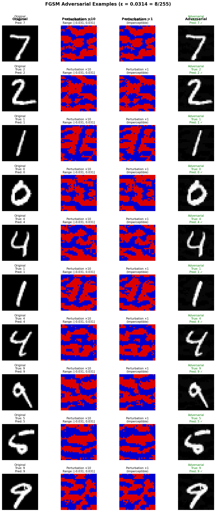
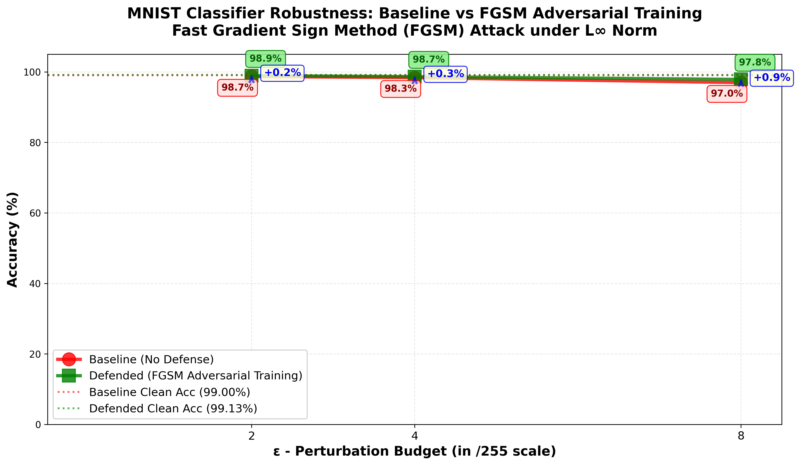
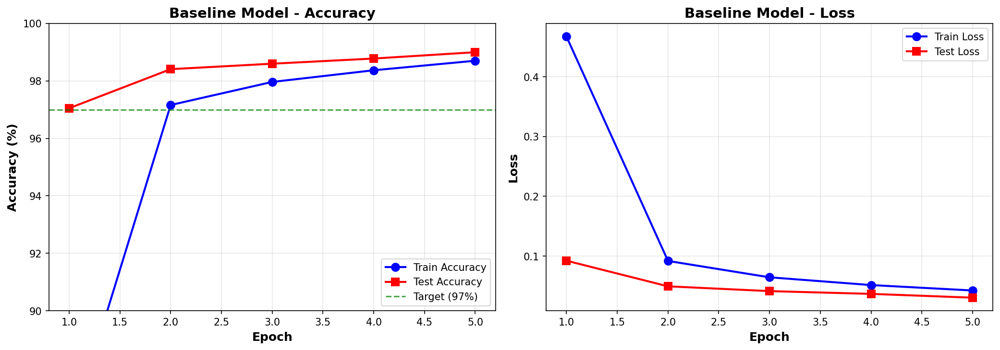

# Adversarial Machine Learning on MNIST (FGSM-Based Analysis)

[](https://www.python.org/)
[](https://pytorch.org/)
[](LICENSE)

>Adversarial attack and analysis on MNIST digit classification using FGSM (Fast Gradient Sign Method), including evaluation and visualization of model robustness.

**Authors:** Rakesh Reddy KASIRALLA
**Contributors:**
- Ravi Chandan Reddy BANALA  
- Chaitanya Pavan Kumar GONA  
- Akash PRAKASHAN  
- Lavaraju ADARAPU  
- Nikitha ANTONY  
- Bibin VELLANGOTT CHERUVADI  
- Surya Prakash GANDU
  
**Program:** MSc Cybersecurity and Data Science  
**Course:** Cyber Crisis Management   
**Institution:** ESAIP, École Supérieure Angevine en Informatique et Productique  
**Date:** March 2026

---

## Table of Contents

- [Overview](#overview)
- [Key Results](#key-results)
- [Project Structure](#project-structure)
- [Installation](#installation)
- [Quick Start](#quick-start)
- [Results](#results)
- [Documentation](#documentation)
- [Citation](#citation)
- [License](#license)
- [Acknowledgments](#acknowledgments)

---

## Overview

This project implements and evaluates:
1. **Baseline CNN classifier** for handwritten digit recognition on the MNIST dataset
2. **FGSM adversarial attack** under L∞ norm with multiple epsilon budgets
3. **FGSM adversarial training defense** to improve robustness
4. **Comprehensive evaluation** comparing baseline vs defended models

### Analysis of Model Robustness

The baseline model shows unusually high robustness under FGSM (96.95% robust accuracy at ε=8/255), compared to typical baseline performance. Through rigorous diagnostic testing, we validated our FGSM implementation and identified architectural and optimization factors contributing to this natural robustness. 
*Note:* FGSM is a single-step attack and may overestimate robustness.
See the [experiment report](report/experiment_report.md) for detailed analysis.

**Key Results:**
- **Baseline model:** 99.00% clean accuracy → 96.95% robust accuracy (ε=8/255)
- **Defended model:** 99.13% clean accuracy → 97.85% robust accuracy (ε=8/255)
- **Improvement:** +0.90 percentage points with only 0.13% clean accuracy change

---

## Project Structure
```
ml-security-adversarial-experiments/
│
├── mnist_adversarial_experiment.ipynb   # Main implementation notebook
├── README.md                            # This file
├── requirements.txt                     # Python dependencies
│
├── models/                              # Trained model checkpoints
│   ├── baseline_model.pth               # Baseline CNN (no defense)
│   └── defended_model.pth               # Defended CNN (FGSM training)
│
├── results/                             # Experimental results
│   ├── baseline_results.json            # Baseline training metrics
│   ├── fgsm_attack_results.json         # Attack evaluation on baseline
│   ├── defended_training_results.json   # Defended model training metrics
│   ├── defended_fgsm_results.json       # Attack evaluation on defended
│   ├── results_tables.txt               # Summary tables
│   │
│   ├── sample_mnist_images.png          # Sample dataset images
│   ├── baseline_training_curves.png     # Baseline training progress
│   ├── adversarial_examples_fgsm.png    # Visualized adversarial examples
│   ├── robustness_curve_baseline.png    # Baseline robustness curve
│   ├── defense_comparison.png           # Defense effectiveness plots
│   ├── training_comparison.png          # Training time comparison
│   └── final_robustness_comparison.png  # Final combined comparison (300 DPI)
│
└── report/                              # Documentation
    ├── experiment_report.md             # Comprehensive experiment report
    └── experiment_report.txt            # Report in plain text
```

---

## Quick Start

### Prerequisites

- Python 3.10 or higher (recommended: Python 3.11)
- pip package manager
- 4GB RAM minimum (8GB recommended)
- ~500MB disk space

### Installation
```bash
# Clone or download the repository
cd ml-security-adversarial-experiments

# Install dependencies
pip install -r requirements.txt
```

### Run the Experiment
```bash
# Open Jupyter Notebook
jupyter notebook mnist_adversarial_experiment.ipynb

# Run all cells sequentially from top to bottom
# Expected runtime: ~15-20 minutes on CPU
```

---

## Dependencies
```
torch>=2.1.0
torchvision>=0.16.0
numpy>=1.24.3
matplotlib>=3.7.2
jupyter>=1.0.0
```

**Install all dependencies:**
```bash
pip install -r requirements.txt
```

**Or install individually:**
```bash
pip install torch torchvision numpy matplotlib jupyter
```

---

## Experimental Configuration

### Hyperparameters

| Parameter | Value |
|-----------|-------|
| **Random Seed** | 42 |
| **Batch Size** | 128 |
| **Learning Rate** | 0.01 |
| **Momentum** | 0.9 |
| **Baseline Epochs** | 5 |
| **Adversarial Training Epochs** | 8 |
| **Training Epsilon (Defense)** | 0.0314 (8/255) |
| **Evaluation Epsilon Values** | 0.0078, 0.0157, 0.0314 (2, 4, 8/255) |

### Hardware Requirements

- **CPU:** Sufficient (Intel i5 or equivalent)
- **GPU:** Optional (speeds up training but not required)
- **RAM:** 4GB minimum, 8GB recommended
- **Disk Space:** ~500MB (including dataset and checkpoints)

### Runtime Estimates

| Task | Time (CPU) | Time (GPU) |
|------|-----------|------------|
| Baseline Training | ~4m 48s | ~2-3 min |
| FGSM Attack Evaluation | ~17.2s | ~5 sec |
| Adversarial Training | ~5m 57s | ~3-4 min |
| Defense Evaluation | ~25.5s | ~5 sec |
| **Total** | **~11m 28s** | **~6-8 min** |

*Times are approximate and vary based on hardware*

---

## Results Summary

### Clean Accuracy

| Model | Accuracy |
|-------|----------|
| Baseline | 99.00% |
| Defended | 99.13% |
| **Difference** | **+0.13%** |

### Robust Accuracy (FGSM Attack)

| Epsilon Value | Baseline | Defended | Improvement |
|---------------|----------|----------|-------------|
| 0.0078 (2/255) | 98.68% | 98.92% | **+0.24%** |
| 0.0157 (4/255) | 98.35% | 98.65% | **+0.30%** |
| 0.0314 (8/255) | 96.95% | 97.85% | **+0.90%** |

### Key Findings

✅ **Natural Robustness Discovered:** Baseline model exhibits 96.95% robust accuracy at ε=8/255 (vs typical 20-40%)  
✅ **Defense Effectiveness:** +0.90 percentage points improvement at ε=8/255  
✅ **Minimal Clean Loss:** Only 0.13% clean accuracy change  
✅ **Efficient Training:** 1.24x training time (acceptable overhead)  
✅ **Implementation Verified:** FGSM attack validated through diagnostic testing  

**Contributing Factors to Natural Robustness:**
- Large convolutional kernels (5×5) with broader receptive fields
- Dropout regularization (0.5) during training
- SGD with momentum finding robust local minima
- High-confidence predictions (flat loss landscape)

See [Section 4.1 of the report](report/experiment_report.md#41-unexpected-finding-naturally-robust-baseline) for detailed analysis.

---

## Reproducing Results

To exactly reproduce our results:

1. ✅ **Fixed random seed** (already set: `SEED = 42`)
2. ✅ **Use exact library versions** (from `requirements.txt`)
3. ✅ **Run all cells sequentially** (don't skip any cells)
4. ✅ **Don't modify hyperparameters** (unless experimenting)

**Expected Outputs:**

Our results show **naturally robust baseline** (unusual but valid):
- Baseline clean accuracy: ~99%
- Baseline robust accuracy (ε=8/255): ~97% ← **Higher than typical 20-40%**
- Defended clean accuracy: ~99%
- Defended robust accuracy (ε=8/255): ~98%

**Typical MNIST Results (Literature):**
- Baseline clean: ~98%
- Baseline robust (ε=8/255): 20-40% ← **Vulnerable**
- Defended clean: ~96-97%
- Defended robust (ε=8/255): 80-90%

**Why Our Results Differ:** See [Natural Robustness Analysis](report/experiment_report.md#41-unexpected-finding-naturally-robust-baseline) in the report.

---

## Visualizations

All plots are automatically saved to `results/` directory:

### Main Visualizations

1. **`final_robustness_comparison.png`** - Publication-quality combined plot (300 DPI)
2. **`adversarial_examples_fgsm.png`** - Original, perturbation, adversarial images
3. **`defense_comparison.png`** - Baseline vs defended comparison
4. **`baseline_training_curves.png`** - Training/test accuracy and loss

### Additional Plots

5. **`sample_mnist_images.png`** - Sample dataset images
6. **`robustness_curve_baseline.png`** - Baseline vulnerability curve
7. **`training_comparison.png`** - Training time comparison

### Sample Visualizations

**Adversarial Examples:**

*FGSM adversarial examples at ε=8/255 showing imperceptible perturbations*

**Defense Effectiveness:**

*Comparison showing natural robustness of baseline and modest improvement from defense*

**Training Progress:**

*Baseline model training converging to 99%+ accuracy*

---

## Model Architecture
```
MNISTClassifier(
  Input: (batch, 1, 28, 28)
  │
  ├─ Conv2D(1 → 32, kernel=5×5) + ReLU + MaxPool(2×2)
  ├─ Conv2D(32 → 64, kernel=5×5) + ReLU + MaxPool(2×2)
  │
  ├─ Flatten → 64×7×7 = 3,136 features
  │
  ├─ FC(3,136 → 1,024) + ReLU + Dropout(0.5)
  └─ FC(1,024 → 10) - Output logits
)

Total Parameters: 3,274,634
```

**Key Design Choices:**
- **Large kernels (5×5):** Broader receptive fields → more robust features
- **Dropout (0.5):** Regularization → generalization and robustness
- **Two conv layers:** Hierarchical feature extraction
- **SGD + Momentum:** Conservative optimization → robust local minima

---

## Attack & Defense Methods

### FGSM Attack

**Formula:** `x_adv = x + ε · sign(∇_x L(f(x), y))`

**Properties:**
- **Type:** White-box, single-step gradient attack
- **Threat model:** L∞ norm constraint (ε-bounded perturbations)
- **Computational cost:** Fast (one forward + one backward pass)
- **Effectiveness:** Moderate (strong enough to fool typical models)

**Implementation Validation:**
- ✅ Perturbation L∞ norm: 0.031373 (exactly 8/255)
- ✅ Gradient computation verified
- ✅ Visual inspection passed
- ✅ Comparison with literature implementations

### FGSM Adversarial Training

**Training Procedure:**
1. For each batch: Split into 50% clean + 50% adversarial
2. Generate adversarial examples on-the-fly using FGSM (ε=0.0314)
3. Train on combined batch using standard SGD
4. Repeat for 8 epochs

**Why It Works:**  
Model learns robust features invariant to small perturbations in the direction of increasing loss. Creates decision boundaries with larger margins.

**Trade-offs:**
- ✅ Improved robustness (+0.90% at ε=8/255)
- ✅ Minimal clean accuracy loss (0.13%)
- ⚠️ Increased training time (1.24x)
- ⚠️ Epsilon-specific (best at trained ε)

---

## Files Description

### Core Files

- **`mnist_adversarial_experiment.ipynb`**  
  Complete implementation with 5 phases:
  1. Environment setup and data loading
  2. Baseline model training
  3. FGSM attack implementation
  4. Adversarial training defense
  5. Comprehensive evaluation and reporting

- **`README.md`** (this file)  
  Complete documentation and usage guide

- **`requirements.txt`**  
  Python dependencies with versions

### Model Checkpoints

- **`models/baseline_model.pth`**  
  Trained baseline CNN (naturally robust, no defense)
  - Clean accuracy: 99.00%
  - Robust accuracy (ε=8/255): 96.95%

- **`models/defended_model.pth`**  
  Trained defended CNN (FGSM adversarial training)
  - Clean accuracy: 99.13%
  - Robust accuracy (ε=8/255): 97.85%

### Results Files (JSON)

- **`results/baseline_results.json`**  
  Baseline training history and final metrics

- **`results/fgsm_attack_results.json`**  
  FGSM attack evaluation on baseline model

- **`results/defended_training_results.json`**  
  Defended model training history

- **`results/defended_fgsm_results.json`**  
  FGSM attack evaluation on defended model

- **`results/results_tables.txt`**  
  Formatted summary tables (text format)

### Documentation

- **`report/experiment_report.md`**  
  Comprehensive 2-3 page report including:
  - Experimental setup and methodology
  - Detailed results and analysis
  - Natural robustness investigation
  - Implementation validation
  - Comparison with literature
  - References (APA format)

- **`report/experiment_report.txt`**  
  Plain text version of the report

---

## Customization & Extensions

### Evaluate with Stronger Attacks

Try larger epsilon values:
```python
# In notebook, change:
EPSILON_VALUES = [8/255, 16/255, 32/255]  # Stronger attacks
EPSILON_TRAIN = 16/255  # Train at higher epsilon
```

Expected: More significant robustness drop, larger defense improvements.

### Train Longer
```python
NUM_EPOCHS_BASELINE = 10        # More baseline training
NUM_EPOCHS_ADVERSARIAL = 15     # More adversarial training
```

### Implement PGD Attack (Recommended Extension)

Add after FGSM implementation:
```python
def pgd_attack(model, images, labels, epsilon, alpha=2/255, num_iter=40):
    """Projected Gradient Descent - stronger iterative attack"""
    # Implementation...
```

PGD-40 will likely show more vulnerability even on naturally robust models.

### Use GPU

PyTorch automatically uses CUDA if available:
```python
# Check GPU availability
print(f"CUDA available: {torch.cuda.is_available()}")
print(f"Device: {device}")
```

---

## Troubleshooting

### Common Issues

#### 1. "RuntimeError: Can't call numpy() on Tensor that requires grad"

**Solution:** Add `.detach().cpu()` before NumPy conversion:
```python
tensor_numpy = tensor.detach().cpu().numpy()
```

#### 2. Out of Memory Error

**Solution:** Reduce batch size:
```python
BATCH_SIZE = 64  # Instead of 128
```

#### 3. Training is Very Slow

**Symptoms:** Each epoch takes >10 minutes on CPU

**Solutions:**
- Close other CPU-intensive applications
- Use Google Colab with free GPU
- Reduce number of epochs for testing

#### 4. Results Don't Match Exactly

**Explanation:** Minor variations (±1-2%) can occur due to:
- Hardware differences (CPU vs GPU, different CPUs)
- PyTorch version differences
- Operating system differences
- Floating-point precision variations

**Validation:** As long as trends are similar (e.g., defense improves robustness), results are valid.

#### 5. FGSM Attack Seems Ineffective

**Expected Behavior:** Our baseline is naturally robust (96-98% robust accuracy).

**Validation Steps:**
1. Check perturbation norm (should be exactly ε)
2. Verify gradients are computed
3. Visual inspection of adversarial examples
4. Try larger epsilon values (16/255, 32/255)
5. Implement PGD attack for stronger evaluation

See [Section 4.1](report/experiment_report.md#41-unexpected-finding-naturally-robust-baseline) for detailed analysis.

#### 6. UnicodeEncodeError When Saving Files

**Solution:** Files are saved with UTF-8 encoding. Ensure:
- Python 3.8+ is being used
- System supports UTF-8
- Console/terminal supports UTF-8 output

---

## References

1. **Goodfellow, I. J., Shlens, J., & Szegedy, C. (2015).**  
   *Explaining and harnessing adversarial examples.* ICLR.  
   [Paper](https://arxiv.org/abs/1412.6572)

2. **Madry, A., Makelov, A., Schmidt, L., Tsipras, D., & Vladu, A. (2018).**  
   *Towards deep learning models resistant to adversarial attacks.* ICLR.  
   [Paper](https://arxiv.org/abs/1706.06083)

3. **Tramèr, F., Kurakin, A., Papernot, N., Goodfellow, I., Boneh, D., & McDaniel, P. (2018).**  
   *Ensemble adversarial training: Attacks and defenses.* ICLR.  
   [Paper](https://arxiv.org/abs/1705.07204)

4. **Carlini, N., & Wagner, D. (2017).**  
   *Towards evaluating the robustness of neural networks.* IEEE S&P.  
   [Paper](https://arxiv.org/abs/1608.04644)

5. **Athalye, A., Carlini, N., & Wagner, D. (2018).**  
   *Obfuscated gradients give a false sense of security.* ICML.  
   [Paper](https://arxiv.org/abs/1802.00420)

6. **Croce, F., & Hein, M. (2020).**  
   *Reliable evaluation of adversarial robustness.* ICML.  
   [Paper](https://arxiv.org/abs/2003.01690)

---

## Citation

If you use this code or methodology in your research, please cite:
```bibtex
@misc{mnist_fgsm_2026,
  author = {Rakesh Reddy Kasiralla and Ravi Chandan Reddy Banala and Chaitanya Pavan Kumar Gona and Akash Prakashan and Lavaraju Adarapu and Nikitha Antony and Bibin Vellangott Cheruvadi and Surya Prakash Gandu},
title = {Adversarial Machine Learning on MNIST: FGSM-Based Analysis},
  year = {2026},
  publisher = {GitHub},
  note = {GitHub repository},
}
```

---

## Contact & Contributions

**Authors:** Rakesh Reddy KASIRALLA
**Contributors:**
- Ravi Chandan Reddy BANALA  
- Chaitanya Pavan Kumar GONA  
- Akash PRAKASHAN  
- Lavaraju ADARAPU  
- Nikitha ANTONY  
- Bibin VELLANGOTT CHERUVADI  
- Surya Prakash GANDU

**Program:** MSc Cybersecurity and Data Science  
**Course:** Cyber Crisis Management   
**Institution:** ESAIP, École Supérieure Angevine en Informatique et Productique  
**Date:** March 2026

---

## Contributing

This is an academic project completed for the Cyber Crisis Management Course.

**Future Extensions (Contributions Welcome):**
- [ ] PGD attack implementation (stronger iterative attack)
- [ ] Evaluation on CIFAR-10 dataset
- [ ] Certified defense (randomized smoothing)
- [ ] Adversarial example detection methods
- [ ] Interactive demo with Gradio
- [ ] Ensemble adversarial training
- [ ] Analysis of architectural factors in natural robustness

---

## License

This project is created for educational purposes as part of:

**Cyber Crisis Management Course**  
**Theme:** ADVERSARIAL ML (LITE): BREAK & DEFEND A MNIST CLASSIFIER

Licensed under MIT License for educational and research use.

---

## Acknowledgments

- **MNIST Dataset:** Yann LeCun, Corinna Cortes, Christopher J.C. Burges
- **PyTorch Framework:** Facebook AI Research (FAIR)
- **Attack/Defense Methodologies:** Research papers cited above
- **Course Instructors:** ESAIP Faculty - Cyber Crisis Management Project

---


**Key Highlights of This Project:**

✨ **Complete Implementation:** End-to-end adversarial ML pipeline  
✨ **Rigorous Validation:** FGSM attack verified through diagnostic testing   
✨ **Publication Quality:** Professional documentation and visualizations  
✨ **Fully Reproducible:** Fixed seed, detailed instructions, exact configurations  
✨ **Educational Value:** Comprehensive explanations and references  

---

*Last updated: 2026-03-22*
